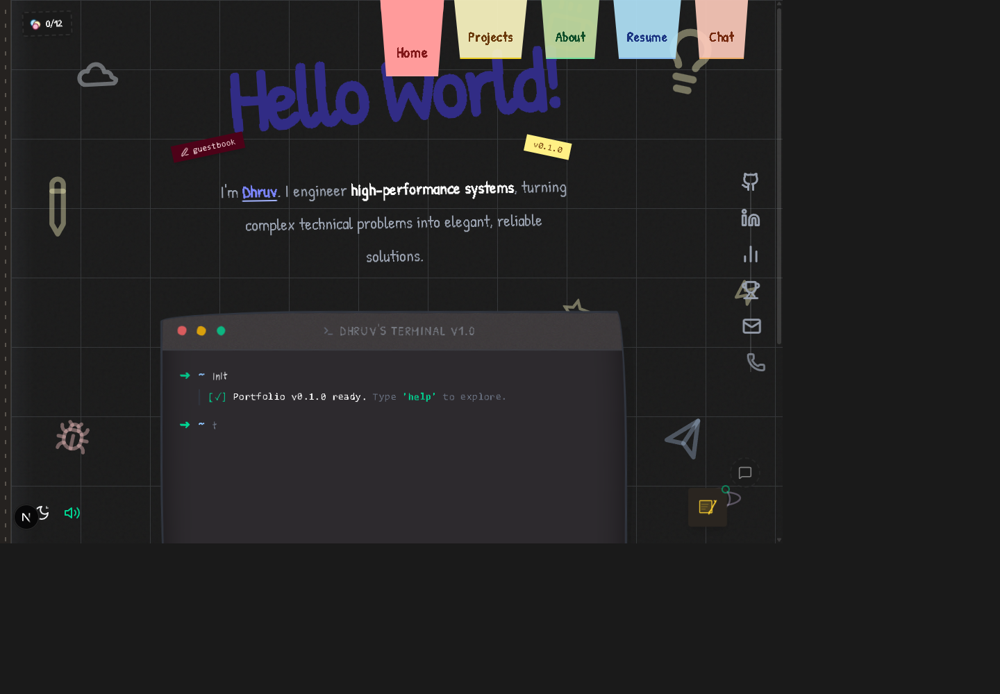
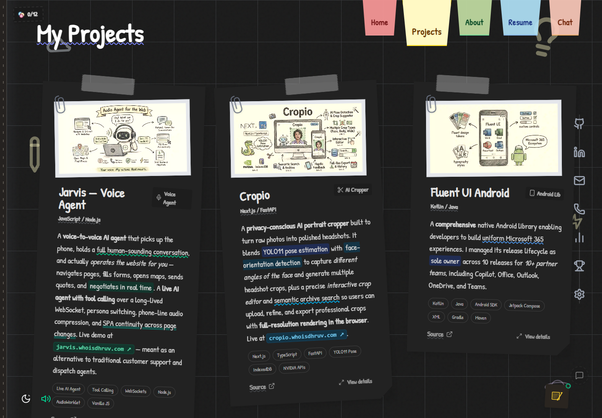
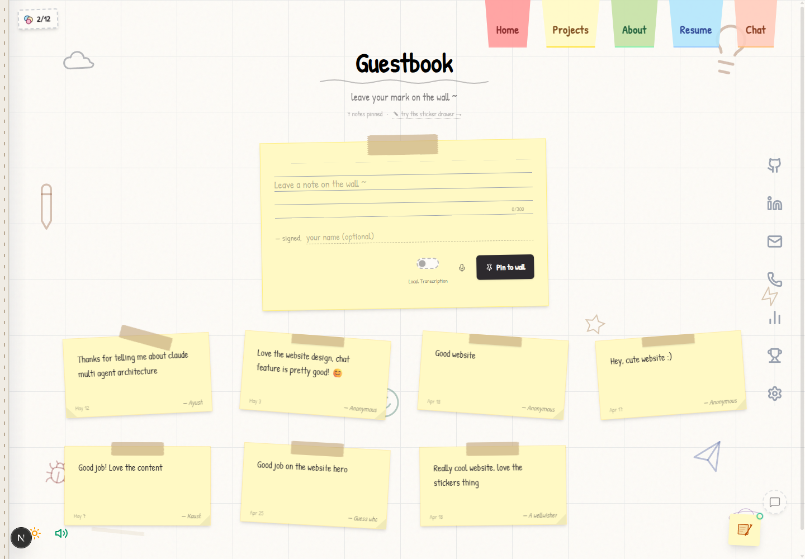
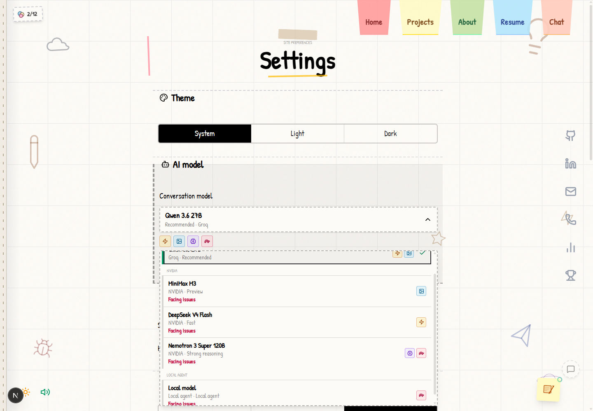
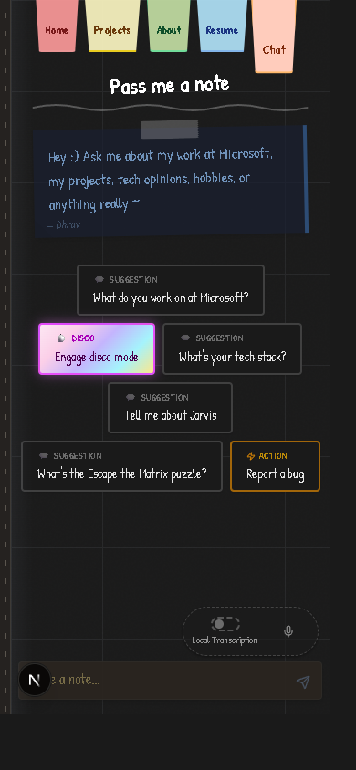
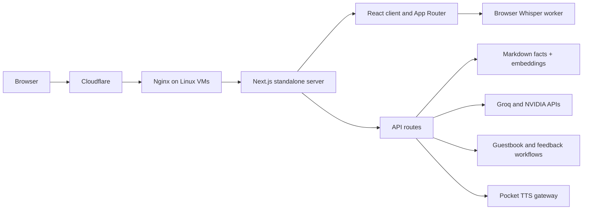

# Dhruv's Sketchbook

The source for [whoisdhruv.com](https://whoisdhruv.com), an interactive portfolio built as a hand-drawn engineering sketchbook. It combines a command-line interface, grounded multimodal AI chat, project case studies, custom speech, a public guestbook, and a small discovery layer that rewards exploration.

[Visit production](https://whoisdhruv.com) · [Preview staging](https://staging.whoisdhruv.com) · [Read the app guide](portfolio/README.md)

## Documentation

- [Architecture](docs/architecture.md)
- [API](docs/api.md)
- [AI and RAG](docs/ai-and-rag.md)
- [TTS](docs/tts.md)
- [Deployment](docs/deployment.md)

## Screenshots

The repository contains five curated product screenshots covering the home interaction, project browsing, guestbook, settings, and mobile chat surface.

| Home and terminal | Project wall |
|---|---|
|  |  |

| Guestbook | Settings and model controls |
|---|---|
|  |  |

<p align="center">
	
</p>

## Experience

- **Sketchbook shell:** responsive light and dark themes, page-turn transitions, a command palette, keyboard shortcuts, optional sound, and small discoverable interactions.
- **Terminal navigation:** a shell-inspired command surface opens portfolio areas, changes allowed presentation state, and keeps the less-obvious interactions part of the experience.
- **Projects and public content:** case-study cards and modals sit alongside resume, Markdown, `llms.txt`, and sitemap routes for people, crawlers, and AI clients.
- **Grounded chat:** server-built context combines a local Markdown fact corpus with its committed embeddings bundle; the browser never receives provider credentials.
- **Model selection with boundaries:** the picker exposes one Groq default, four NVIDIA-hosted choices, and an optional OpenAI-compatible local agent: six selections total. Model IDs are server allowlisted, and image input appears only for vision-capable choices.
- **Voice in and out:** users can choose browser-native recognition or local Whisper transcription in a Web Worker. Server custom voice uses Pocket TTS, streams generated audio, caches playback in the browser, and can fall back to device speech.
- **Product workflows:** a GitHub-backed guestbook, private feedback, stickers, settings, and deterministic chat actions extend the portfolio beyond a static presentation.

For the component, API, runtime, and delivery boundaries behind these surfaces, read the [architecture HLD](docs/architecture.md).

Some commands and interactions intentionally remain undocumented so the site keeps its discovery layer.

## AI Chat

The chat boundary is deliberately narrow: model and provider IDs are server-allowlisted, provider keys never reach the browser, assistant history is signed before reuse, requests are origin-checked and rate-limited, and remote replies are sanitized before rendering.

Image attachments are request-scoped and never persisted to local storage. Before upload, the browser:

1. Accepts JPEG, PNG, or WebP files up to 10 MB.
2. Corrects browser decoding and renders onto a high-quality canvas.
3. Downscales the longest edge to at most 1280 px.
4. Encodes JPEG at a quality floor of 0.60, progressively reducing dimensions until the image is at most 128 KiB.

This keeps enough detail for screenshots and visual questions while reducing base64 overhead, provider latency, and request-size failures. When a selected provider is unavailable, the route returns the local static fallback rather than silently switching models.

### Models

| Runtime | Model | Capability |
|---|---|---|
| Groq | Qwen 3.6 27B | Recommended, fast, vision |
| NVIDIA | MiniMax M3 | Preview, vision; non-commercial use only |
| NVIDIA | DiffusionGemma 26B | Vision |
| NVIDIA | DeepSeek V4 Flash | Fast |
| NVIDIA | Nemotron 3 Super 120B | Reasoning |
| Local agent | Local model | Optional, text-only |

### Chat Actions

The LLM is not given arbitrary browser or operating-system access. Recognized requests resolve through a deterministic, validated action layer with six tool families:

| Tool | Allowed result |
|---|---|
| Navigate | Open home, about, projects, resume, chat, guestbook, stickers, or settings |
| Project | Open one of the nine allowlisted project detail modals |
| Open link | Open approved profile, contact, resume, project source, demo, or research links |
| Appearance | Switch light/dark theme or enter/exit disco mode |
| Feedback | Open the feedback note |
| Command palette | Open the site's command palette |

Action chips and contextual follow-up suggestions cover the same allowlist, so suggested actions cannot grant capabilities beyond those the router already validates.

## Architecture



### Stack

- Next.js 16 App Router, React 19, and strict TypeScript 5
- Tailwind CSS 4, Framer Motion 12, and Lucide icons
- Groq SDK plus OpenAI-compatible NVIDIA and optional legacy providers
- Transformers.js for local transcription and Pocket TTS 2.1 for server speech
- Vitest 4 and ESLint 9
- Dockerized standalone output on Linux VMs behind Cloudflare and Nginx

## Local Development

Requirements: Node.js 22 or newer and npm 10.9.8.

```bash
git clone https://github.com/Dhruv-Mishra/dhruvwebsite.git
cd dhruvwebsite/portfolio
npm install
npm run dev
```

Open [http://localhost:3000](http://localhost:3000). The committed embedding bundle supports local builds without provider credentials; online chat, GitHub workflows, and custom speech require their corresponding server-side configuration.

| Command | Purpose |
|---|---|
| `npm run dev` | Start the development server |
| `npm run build` | Generate embeddings when configured and build standalone output |
| `npm run start` | Run the production server locally |
| `npm run lint` | Run ESLint |
| `npm run typecheck` | Run the TypeScript compiler without emitting files |
| `npm test` | Run the Vitest suite |

Configuration, container setup, Pocket TTS requirements, and deployment contracts are documented in [portfolio/README.md](portfolio/README.md).

## Repository

```text
portfolio/app/              pages, public routes, and API handlers
portfolio/components/       sketchbook UI and interactive surfaces
portfolio/content/facts/    retrieval corpus for grounded chat
portfolio/context/          React providers
portfolio/hooks/            client controllers and persistence
portfolio/lib/              models, actions, integrations, and tests
portfolio/public/           fonts, media, sounds, and static assets
portfolio/scripts/          build, smoke-test, and deployment tooling
docs/screenshots/           curated GitHub screenshots
```

## Deployment

Development is promoted through environment branches:

```text
dev/lkg -> deployed/staging -> deployed/production
```

- `deployed/staging` deploys Docker images to [staging.whoisdhruv.com](https://staging.whoisdhruv.com).
- `deployed/production` deploys to [whoisdhruv.com](https://whoisdhruv.com) after the production environment gate.
- Each environment has separate signing, access, provider, and speech credentials.
- Deploy workflows validate VM identity and image architecture, run health checks, verify the deployed SHA, and retain rollback releases.

Cloudflare provides the public edge; Nginx routes traffic to the standalone Next.js service on the VM fleet. The complete operational contract lives in [portfolio/README.md](portfolio/README.md).

## Contributing

Start with [AGENTS.md](AGENTS.md), then read the nearest directory-level guide before editing. Preserve the runtime Markdown routes, retrieval corpus, hidden discovery layer, theme support, accessibility, and mobile behavior. Run lint, type checking, and relevant Vitest coverage before opening a pull request.
