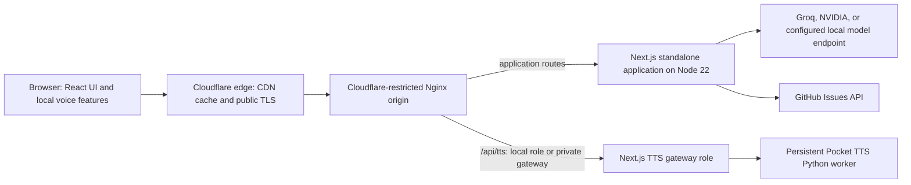
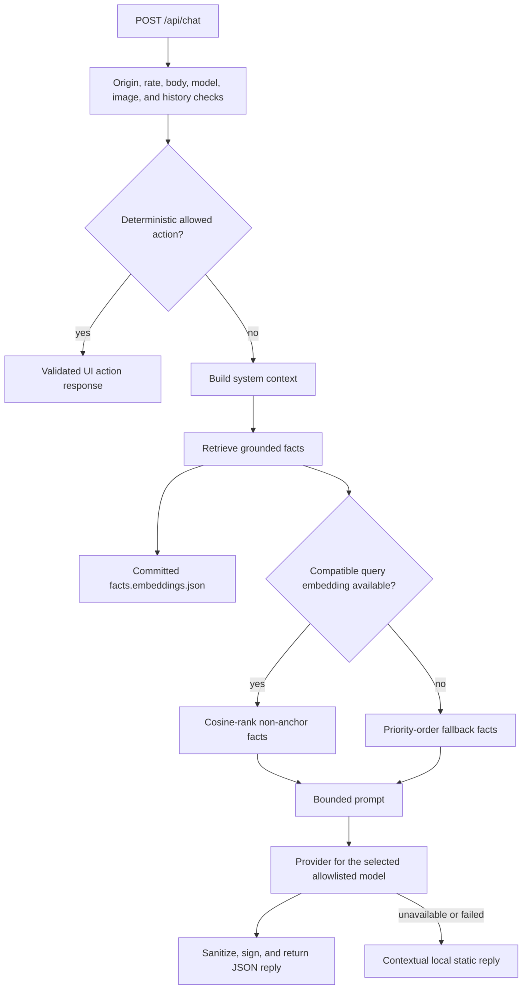
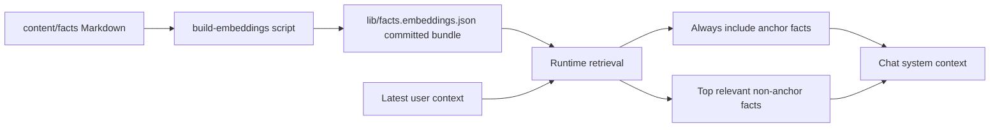

# Architecture

This HLD describes the deployed system as implemented today, not a target-state design. The public overview and product screenshots are in [the root README](../README.md); endpoint contracts, operator procedures, and model details remain in their focused guides.

## System Context



Cloudflare is the public edge for CDN caching and TLS. The application does not currently place a Cloudflare Worker or other edge-compute service in the request path. Nginx accepts the Cloudflare origin path, enforces proxy and request controls, serves selected static assets from the standalone release, and forwards application traffic to Node.

## Design Boundaries

| Boundary | Responsibility | Explicitly not responsible for |
|---|---|---|
| Browser | Interactive UI, local preference state, image preparation, browser speech recognition, and playback | Provider credentials, server actions, and GitHub tokens |
| Cloudflare | Public TLS, CDN behavior, and the public ingress layer | App-route execution or a durable queue |
| Nginx | Cloudflare peer policy, static file serving, reverse proxying, caching, and request-rate controls | Business logic or model selection |
| Next.js App Router | Pages, API contracts, request validation, chat assembly, GitHub integrations, and local TTS orchestration | Cross-request durable job scheduling |
| Provider and gateway integrations | Model inference, issue storage, and speech synthesis | Browser session authority or arbitrary tool access |

The important distinction is that the system has ingress policies and per-process limits, but no dedicated global LLM queue, broker, or Cloudflare Worker. The only explicit request queue is local to Pocket TTS and protects one synthesis worker.

## Frontend HLD

### Rendering and interaction model

- The app uses Next.js 16 App Router with React 19 and strict TypeScript. Server components are the default; client components own browser state, effects, gestures, sound, and other interactive behavior.
- The visual shell is intentionally more product-like than a document site: it includes the sketchbook navigation, terminal, command palette, project cards and modals, settings, feedback, guestbook, and a mobile chat composition.
- `next.config.ts` produces standalone output, disables runtime image optimization, sets browser-facing security and cache headers, and pins a consistent build ID for multi-origin releases.
- Static resources and selected Next assets can bypass Node at Nginx. Public pages receive CDN-oriented cache headers; API routes are not treated as cacheable page content.

### Voice and media in the browser

```mermaid
flowchart LR
  Mic[Microphone input] --> VoiceChoice{Selected voice input}
  VoiceChoice --> Native[Browser native speech recognition]
  VoiceChoice --> Whisper[Transformers.js Whisper in a Web Worker]
  Native --> Composer[Chat composer]
  Whisper --> Composer
  Composer --> Chat[/api/chat]
  ChatReply[Chat response] --> Tts[/api/tts or device speech]
  Tts --> Playback[Browser audio playback and cache]
```

- Voice input is browser-local: the user can select native speech recognition or an optional Whisper pipeline loaded through a Web Worker. The model is downloaded and cached by the browser rather than sent to an application STT endpoint.
- Before a vision request leaves the browser, the client accepts only JPEG, PNG, or WebP, corrects and resizes it on canvas, and reduces it to the chat route's bounded image payload.
- The model picker is driven by the registry. It exposes image attachment only when the active model advertises vision support.
- Generated custom speech is cached by the playback layer. Device speech remains an output fallback when custom voice cannot be used.

## Backend HLD

### Application routes and trust boundary

Route handlers run in the Node.js runtime. They validate at the application boundary before reaching an upstream integration:

1. Origin validation rejects cross-origin use of the expensive routes.
2. Nginx rate limits the request path, then an in-memory Node limiter applies a second per-IP limit within that process.
3. Routes bound body size, message history, image content, model identifiers, and action parameters.
4. Server-only configuration supplies provider keys, signing material, GitHub tokens, and speech credentials. `NEXT_PUBLIC_*` values are the only intentionally browser-visible configuration.

The in-process rate limiter is local to each Node process. It complements the reverse-proxy policy; it is not a distributed counter shared across all origins.

### Chat request flow



- Assistant turns must carry a valid server HMAC before they can be reused as chat history. User turns and validated history are clipped to the route limits.
- The action layer is deterministic and allowlisted. It can return constrained navigation, project, appearance, feedback, or command-palette actions; it does not grant arbitrary browser or operating-system access.
- The route creates a bounded request deadline and aborts individual provider attempts when their budget expires. Provider SDK retries are disabled at the client configuration point.
- NVIDIA completions may stream from the upstream provider while the server aggregates their text. The browser-facing chat route returns a JSON response rather than an SSE token stream.

### Retrieval-augmented generation



The retrieval bundle is built from the Markdown fact corpus and committed so runtime deployment does not depend on regenerating embeddings. For a compatible external bundle, the query is embedded with the same model and non-anchor facts are ranked by cosine similarity. Local development and CI can use deterministic hashed n-gram embeddings instead. If query embedding fails, retrieval degrades to priority ordering instead of failing the chat request.

### LLM providers and selection

| Selection | Current provider path | Capability handling | Failure behavior |
|---|---|---|---|
| Recommended default | Groq Qwen 3.6 27B | Vision-capable | Local static fallback when unavailable |
| 3 NVIDIA selections | NVIDIA's OpenAI-compatible endpoint | Per-model vision and sampling compatibility | Local static fallback when unavailable |
| Local agent | Configured OpenAI-compatible endpoint | Optional and text-only | Local static fallback when unavailable |

The route accepts only IDs in the model registry. A model selection maps to its configured provider path; the application does not silently swap the user's selected model for a different model after a provider failure. See [AI and RAG](ai-and-rag.md) for the active registry and configuration requirements.

## TTS HLD

```mermaid
flowchart LR
  Browser[Same-origin browser request] --> Edge[Cloudflare and Nginx]
  Edge --> Route[/api/tts]
  Route --> Role{TTS node role}
  Role -->|local| Local[Local Next.js TTS route]
  Role -->|remote| Gateway[Configured private TTS gateway]
  Gateway --> Local
  Local --> Slot[One active synthesis slot and bounded local queue]
  Slot --> Worker[Persistent Pocket TTS Python worker]
  Worker --> Stream[WAV or NDJSON PCM frames]
  Stream --> Browser
```

- `POST /api/tts` validates origin, IP rate, content length, body shape, text, and synthesis options. It returns WAV by default or streamed NDJSON audio frames when requested.
- A local TTS role runs Pocket TTS in a persistent Python child process. A remote role has Nginx forward only `/api/tts` over the configured private gateway path.
- Synthesis concurrency is fixed at one. A bounded in-memory queue accepts waiting work up to the configured limit and returns `429` when full. This queue exists to protect the local speech worker; it is not an LLM queue or a durable message system.
- The worker emits 24 kHz PCM16 chunks. Nginx disables buffering and caching for the streaming TTS route so playback can begin before the full synthesis completes.
- The container supplies Python and the CPU Pocket TTS runtime. The persistent cache stores model artifacts and derived voice state on the local TTS role.

See [TTS](tts.md) for the endpoint contract, role configuration, and smoke checks.

## Ingress, Caching, and Load Behavior

| Layer | Implemented behavior | Scope and limitation |
|---|---|---|
| Cloudflare | Public TLS and CDN caching for cacheable content | No application Worker or shared application queue is configured here |
| Nginx | Accepts allowed Cloudflare peers, serves static files, proxy-caches eligible pages, disables API caching, and applies `limit_req` controls | Per-origin reverse-proxy control; not business logic |
| Next.js route handlers | Origin checks, bounded JSON and media parsing, deadlines, and per-IP in-memory limits | Limit state is per Node process |
| Chat providers | Request-scoped deadline and abort propagation | No background retry worker or durable provider job |
| Local TTS | One active synthesis and bounded pending work | In-memory protection for the TTS role only |

Nginx and Next both defend the request boundary because they cover different failure modes: the proxy rejects excess traffic before it reaches Node, while the route enforces semantic request bounds and protects direct application execution. This is defense in depth, not a claim of globally coordinated rate limiting.

## Data and Integration Ownership

| Data or integration | System of record | Access path |
|---|---|---|
| Portfolio facts | Markdown files under `portfolio/content/facts/` | Build-time embedding generation and runtime bundle loading |
| Retrieval bundle | Committed `portfolio/lib/facts.embeddings.json` | Read-only server runtime import |
| Chat history integrity | Signed assistant payloads | Server verification before reuse |
| Guestbook and feedback | GitHub Issues | Server-side GitHub API credentials |
| Custom voice state | Persistent cache on the local TTS role | Server-only Python worker |
| Provider and deployment secrets | Environment and protected VM configuration | Server and workflow execution only |

Image attachments are request-scoped. The client reduces them before submission, and the route validates the resulting data URL before provider invocation. They are not treated as a persisted chat asset.

## Delivery and Operations

```mermaid
flowchart LR
  Dev[dev/lkg] --> PromoteStaging[Promote staging]
  PromoteStaging --> StagingRef[deployed/staging]
  StagingRef --> Checks[Install, lint, typecheck, and Vitest]
  Checks --> Image[Build multi-architecture GHCR image]
  Image --> Staging[Staging Linux VM deployment]
  Staging --> Approval[Production environment approval]
  Approval --> ProductionRef[deployed/production]
  ProductionRef --> Production[Serial production deployment]
```



- CI validates the package lock, runs lint, strict TypeScript checks, and Vitest before publishing the Docker image for `linux/amd64` and `linux/arm64`.
- Docker builds the Next standalone application and includes the Python Pocket TTS runtime. Deployment uses an immutable image digest on Linux VMs behind Cloudflare and Nginx.
- The release flow moves from `dev/lkg` to `deployed/staging`, then to `deployed/production` only after the configured production approval. Production deployment has its own environment gate.
- Host validation checks identity, Docker, Nginx, runtime configuration, architecture, and TTS role. The local TTS role deploys first; remote roles follow. Health checks and TTS synthesis checks gate activation, and retained releases support rollback.
- Every origin in a rollout must serve the same `NEXT_BUILD_ID`; otherwise HTML from one origin could reference static assets absent from another.

The deployment mechanics and rollback procedures live in [Deployment](deployment.md). The [Dockerfile](../portfolio/Dockerfile), [Nginx template](../portfolio/nginx-cloudflare.conf), [Next configuration](../portfolio/next.config.ts), and route handlers under [the API directory](../portfolio/app/api) remain the executable source of truth.

## Documentation Map

| Guide | Use it for |
|---|---|
| [Architecture](architecture.md) | System boundaries, data flows, load behavior, and delivery shape |
| [API](api.md) | Browser-facing endpoint contracts and controls |
| [AI and RAG](ai-and-rag.md) | Model selection, retrieval, and server configuration |
| [TTS](tts.md) | Pocket TTS behavior and gateway operations |
| [Deployment](deployment.md) | Promotion, container delivery, rollback, and operator checks |