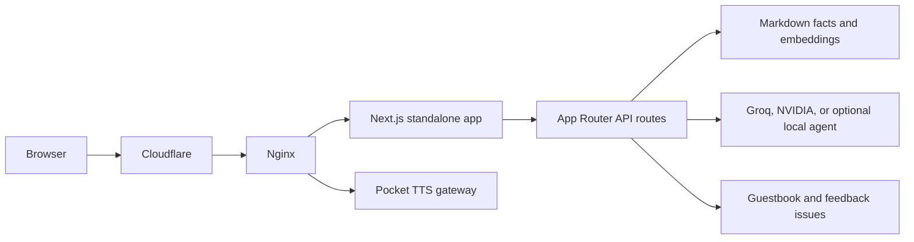

# Architecture

This is the current runtime shape for the portfolio application. The public overview is in [the root README](../README.md); operational details live in the focused guides below.

## Runtime

- The app is a Next.js 16 App Router application with React 19 and strict TypeScript.
- `next.config.ts` builds standalone output. The Docker image runs that server on Node 22 and exposes port 3000.
- Cloudflare sits at the public edge. Host Nginx terminates the origin path, serves selected static assets, and proxies application traffic to the standalone server.
- The TTS path may be proxied separately to a local gateway role. See [TTS](tts.md).

## Application Boundaries

- UI pages and route handlers live under `portfolio/app/`.
- Chat facts originate in `portfolio/content/facts/`; `portfolio/lib/facts.embeddings.json` is the committed retrieval bundle used at runtime.
- Model keys, GitHub tokens, signing values, and Hugging Face credentials remain server-side runtime configuration. Public `NEXT_PUBLIC_*` values must be safe to expose.
- Guestbook and feedback handlers create or read GitHub Issues through server-side credentials.

## Source of Truth

- [Next configuration](../portfolio/next.config.ts) defines standalone output, headers, caching, and the TTS tracing inclusion.
- [Nginx template](../portfolio/nginx-cloudflare.conf) defines the reverse-proxy and cache behavior.
- [Dockerfile](../portfolio/Dockerfile) defines the Node and Python runtime image.
- [API routes](../portfolio/app/api) own request contracts. Only the browser-facing subset is described in [API](api.md).

## Documentation Map

| Guide | Use it for |
|---|---|
| [Architecture](architecture.md) | Runtime boundaries and request flow |
| [API](api.md) | Browser-facing endpoint contracts and controls |
| [AI and RAG](ai-and-rag.md) | Model selection, retrieval, and server configuration |
| [TTS](tts.md) | Pocket TTS behavior and gateway operations |
| [Deployment](deployment.md) | Promotion, container delivery, rollback, and operator checks |