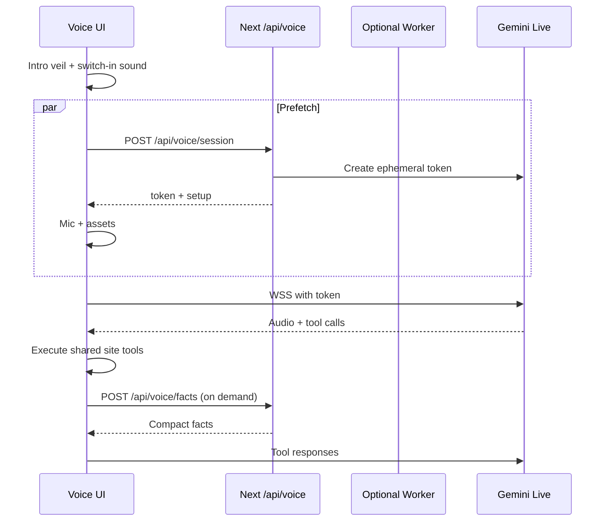

# Native Voice Agent

Production voice mode for the sketchbook. The browser talks to a native
audio model. Site tools stay model-agnostic. Switching providers should
only require changing the voice-caller adapter.

## Decisions

| Topic | Decision |
|---|---|
| Entry | Homepage folded-note CTA `Talk to me`, plus settings `Enter voice mode`, command palette `action-enter-voice-mode`, chat-page corner control, and the chat-only `start_voice_session` tool. Starting voice does not navigate to `/chat`. |
| Persistence | Module singleton `voiceSessionRuntime` owns the live socket, playback, capture, and action queue. React only subscribes. Same call across routes = same socket. New call after hangup remints and greets once. |
| HUD | Intro is a blocking black veil until socket ready + first greet `turnComplete` + playback idle. Then the veil fades and the orb FLIPs into a non-modal dock. |
| Queue | Send tool replies immediately. Commit visuals later: `navigate_to`, `open_*`, and `end_voice_session` wait for playback idle. Hangup twice forces. Client `planVoiceUtterance` backfills explicit chains (max 3) into the same FIFO queue. Dependent hosts (`project-video`, `terminal`, `chat`) must be ready before those commits. |
| Transport | Client-to-model WebSocket with ephemeral tokens. Do not proxy PCM through the origin or a Worker. |
| Worker | Optional edge mint + health on a Worker. Audio stays direct. |
| Default voice | Male `Charon`. |
| Context | Tiny system prompt plus on-demand `lookup_site_facts`. No full fact bank in the live session. |
| Tools | Shared `siteTools` registry. Chat and voice use the same names. |
| Compression | Gemini Live is PCM only (16 kHz in, 24 kHz out). The settings toggle is **low-network mode**: smaller frames, no live transcripts, no ambient music. True Opus would add a Worker hop and extra latency, so it is off by default. |
| Context window | Live `contextWindowCompression` is always enabled. |
| Pipeline | Staging/production inject `VOICE_AGENT_API_KEY` from `STAGING_VOICE_AGENT_API_KEY` / `PRODUCTION_VOICE_AGENT_API_KEY`. Worker uses the same secret names. |

## Flow

## Model-agnostic boundary

- UI, settings, and tools import `@/lib/voiceAgentProtocol` and `@/lib/siteTools`.
- Only `@/lib/geminiLiveAdapter.ts` and server token minting know Gemini.
- A future OpenAI Realtime / other adapter implements `VoiceCaller`.

## Tools

Shared names:

- `navigate_to`
- `set_theme`
- `open_project`
- `control_project_video`
- `open_link`
- `open_feedback`
- `open_command_palette`
- `open_shortcuts`
- `open_chat`
- `browse_history`
- `scroll_page`
- `send_chat_message`
- `run_terminal_command`
- `fill_field`
- `set_preference`
- `set_voice_output`
- `set_voice_backend`
- `set_motion_preference`
- `submit_guestbook`
- `lookup_site_facts`
- `start_voice_session`
- `end_voice_session`

Live voice tools omit `start_voice_session`. Chat/text can still offer it.

## Welcome

On connect, the host selects one concise first-visit greeting and an
immediately executable hint from a hardcoded catalog. The catalog and random
selection stay out of the model prompt. Hints are site actions such as open
projects or show Cropio, never Jarvis trivia. After the first spoken turn
finishes, the veil settles into a floating dock and the rest of the site stays
interactive. The dock orb ripples from live playback energy.
