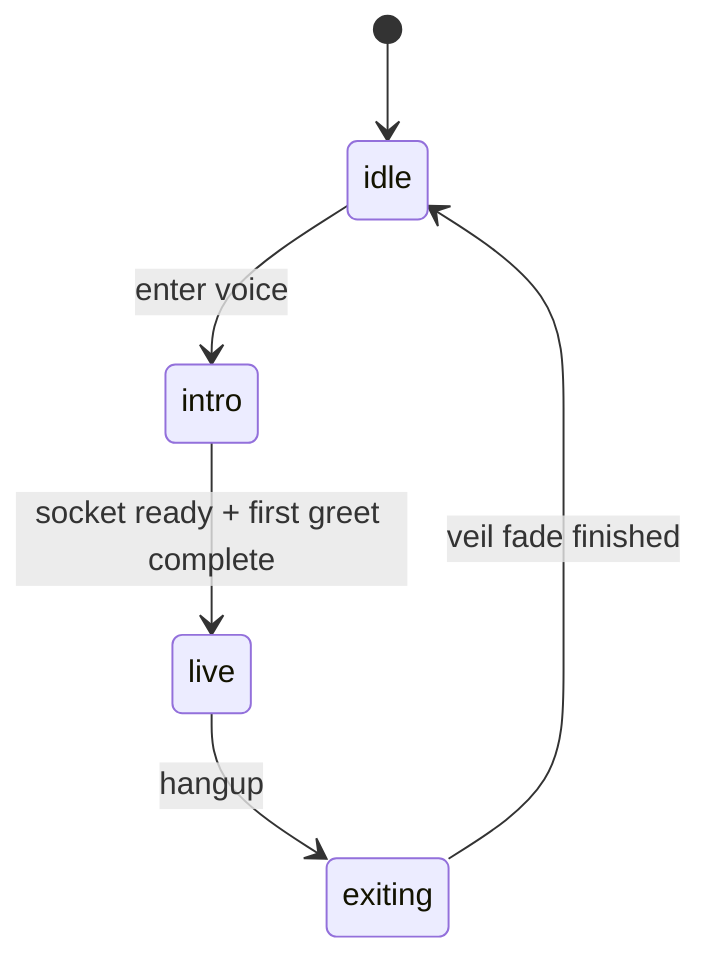
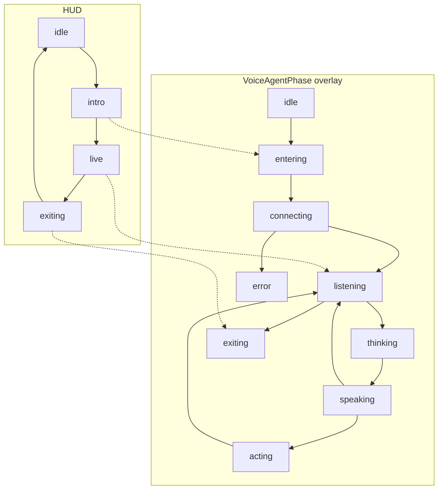
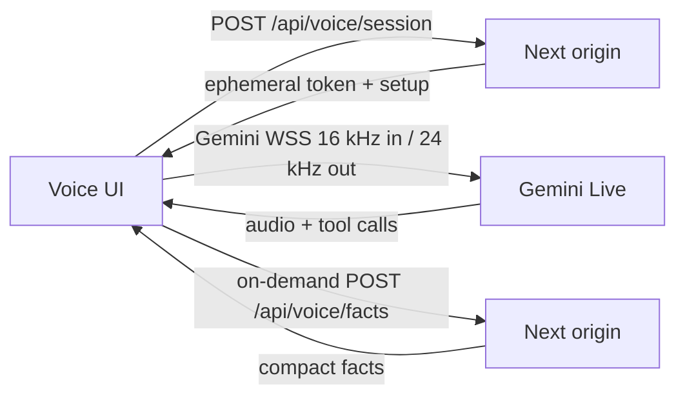
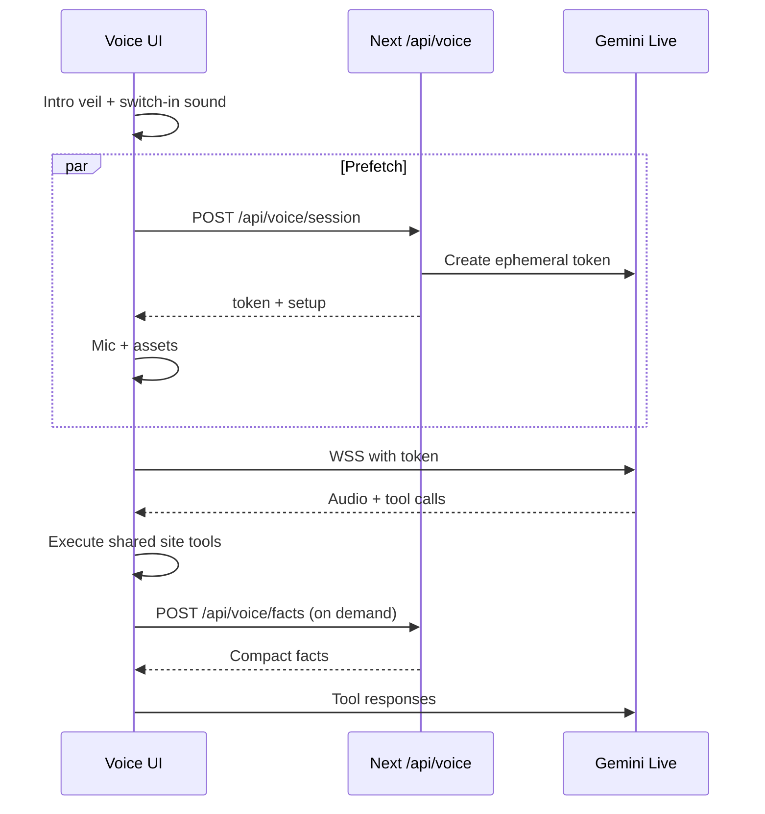

# Native Voice Agent

Production voice mode for the sketchbook. The browser talks to a native
audio model. Site tools stay model-agnostic. Switching providers should
only require changing the voice-caller adapter.

The HUD, welcome, audio timing, and barge-in polish shipped in `v0.24.0`.
The app is `0.30.0` and later.

## Decisions

| Topic | Decision |
|---|---|
| Entry | Homepage folded-note CTA `Talk to me`, plus settings `Enter voice mode`, chat-page corner control, and the chat-only `start_voice_session` tool. Starting voice does not navigate to `/chat`. |
| Persistence | Module singleton `voiceSessionRuntime` owns the live socket, playback, capture, and action queue. React only subscribes. Same call across routes = same socket. The socket stays open only while the call is live; after a spoken idle check-in and hangup the host closes it. New call after hangup remints and greets once. |
| HUD | Intro is a blocking black veil until `setupComplete` + first greet `turnComplete` + playback idle. The orb appears only during intro/exit. Live mode uses a pointer-free cyan edge halo, bottom-right hangup control, and separate captions. The halo has 42px soft bands with darker cyan in light mode and brighter cyan in dark mode. Parent breathing and four independently timed, phase-offset edge flows avoid a tiled wave pattern; system or explicit reduced motion leaves static bands. Entry, exit, ambient, and action media are preloaded on voice intent and isolated from model PCM. Sound URLs are version-query cache-busted. Captions fade after ~700ms. Exiting holds a ~2.2s black veil; the fade finishes before unmount. |
| Queue | Gemini tool calls are authoritative and execute serially. Visual actions wait for playback idle, and dependent hosts (`project-video`, `terminal`, `chat`, `guestbook`, `feedback`) must be ready before commit. Provider cancellation IDs prevent queued actions from committing. Hangup twice forces. |
| Transport | Client-to-model WebSocket with one-use ephemeral tokens minted by `POST /api/voice/session`. `setupComplete` gates readiness. Post-ready failures remint and resume up to two times with the latest valid provider handle and no second greeting; exhausted recovery offers Try again or hangup. PCM does not transit the origin. |
| Default voice | Male `Charon`. |
| Context | Tiny initial page snapshot plus on-demand `lookup_site_facts` and read-only `get_recent_user_context`. The recent-context tool samples lazy live context (allowlisted browser route, project, theme, preferences) plus recent semantic events from the bounded action journal; it never exposes raw URLs, DOM, or form values. |
| Tools | Voice uses the canonical `siteTools` contract. Text chat keeps deterministic signed actions and reuses the same browser executor and events where needed; text providers receive no tool catalog. `hint` is the one puzzle-safe voice terminal command. |
| Audio | Gemini Live uses PCM16 little-endian at 16 kHz in and 24 kHz out. Playback uses a bounded prebuffered queue, explicit decoding, short gain ramps, and stale-audio resynchronization. Capture remains full-duplex and requests browser echo cancellation and noise suppression. |
| Compression | The settings toggle is **low-network mode**: larger capture frames, no live transcripts, no ambient music. |
| Context window | Live `contextWindowCompression` is always enabled. |
| Pipeline | Staging/production inject `VOICE_AGENT_API_KEY` from `STAGING_VOICE_AGENT_API_KEY` / `PRODUCTION_VOICE_AGENT_API_KEY`. |

## HUD and agent state

HUD phases are `idle`, `intro`, `live`, and `exiting`. `VoiceAgentPhase`
overlays that HUD while the call is active.

`VoiceAgentPhase` values are `idle`, `entering`, `connecting`, `listening`,
`thinking`, `speaking`, `acting`, `exiting`, and `error`. The overlay diagram
is a catalog of those labels, not a claim that every transition is used.

## Live audio pipeline

The browser mints a session on the origin, then opens Gemini Live directly.
PCM does not transit the origin.

Model PCM is decoded explicitly as little-endian audio, held behind a short
jitter prebuffer, scheduled continuously, and capped so network bursts cannot
grow into stale playback. Short fades suppress boundary clicks; interruption
flushes queued playback and later packets are accepted immediately. Entry and
action cues stop while PCM is active, and ambient fades to silence until model
speech is idle.

Mic capture remains live during playback for server VAD and barge-in. The
browser is asked for echo cancellation and noise suppression; support and
quality remain device-dependent. A callback gap over 1.1s sends one
`audioStreamEnd`, then rearms when capture resumes. If microphone access fails,
the HUD shows an actionable browser/device error and keeps the permission
flow available. Setup, transport, and playback activation failures fully tear
down media before presenting Try again or hangup.

## Flow

## Model-agnostic boundary

- UI, settings, and tools import `@/lib/voiceAgentProtocol` and `@/lib/siteTools`.
- Only `@/lib/geminiLiveAdapter.ts` and server token minting know Gemini.
- Text chat does not use provider tool calling; signed actions reuse shared browser execution primitives where needed.
- A future OpenAI Realtime / other adapter implements `VoiceCaller`.

## Tools

Canonical site tool names:

- `navigate_to`
- `set_theme`
- `open_project`
- `close_project`
- `control_project_video`
- `open_link`
- `open_feedback`
- `open_shortcuts`
- `open_chat`
- `browse_history`
- `scroll_page`
- `send_chat_message`
- `run_terminal_command`
- `fill_field`
- `set_preference`
- `set_master_volume`
- `set_audio_category_volume`
- `set_voice_output`
- `set_voice_backend`
- `set_motion_preference`
- `submit_guestbook`
- `submit_feedback`
- `lookup_site_facts`
- `get_recent_user_context`
- `start_voice_session`
- `end_voice_session`

Live voice tools omit `start_voice_session`. Chat/text can still offer it.

## Welcome

On connect, the host picks one greeting and one invitation from hardcoded
catalogs in `voiceAgentProtocol`. Greetings open warmly, then briefly
introduce Dhruv Mishra's portfolio. Invitations may use natural
“try saying” phrasing. The spoken cue concatenates greeting + invitation
as one exact line and has no `Hint:` label. After a quiet live stretch the
host sends a picked check-in, then a hangup line, then closes the socket.
Hangup first shows a picked exit-veil line on the black screen for ~2.2s;
the fade must finish before unmount. Random selection stays out of the
model prompt. After the first spoken turn finishes, the veil settles into
a floating dock and the rest of the site stays interactive. Dock captions
fade after ~700ms; orb ripples stay up while PCM is still playing. Gemini
VAD uses LOW start/end sensitivity with padding. Ambient unlocks on the
enter gesture and becomes audible after the toggle. Off-topic asks get a
short in-character redirect back to the site.
