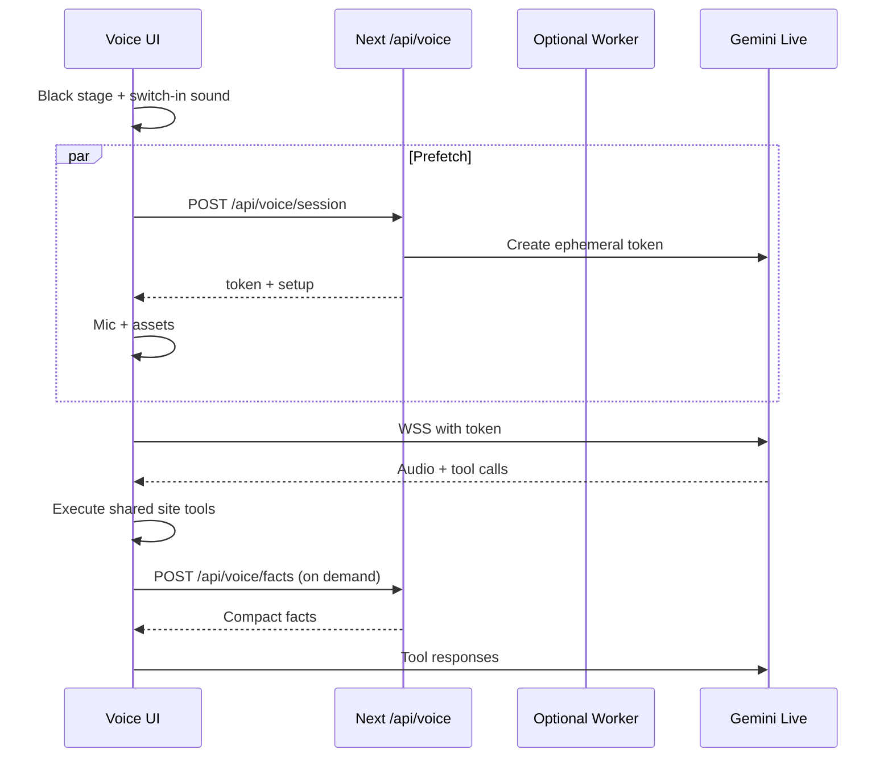

# Native Voice Agent

Production voice mode for the sketchbook. The browser talks to a native
audio model. Site tools stay model-agnostic. Switching providers should
only require changing the voice-caller adapter.

## Decisions

| Topic | Decision |
|---|---|
| Entry | Chat page Voice control, command palette `Enter voice mode`, settings, and the `start_voice_session` chat tool. Not a sixth nav tab. |
| Chat replacement | `/chat` becomes the voice stage while a session is active. Mini-chat and the composer hide. |
| Transport | Client-to-model WebSocket with ephemeral tokens. Do not proxy PCM through the origin or a Worker. |
| Worker | Optional edge mint + health on a Worker. Audio stays direct. |
| Default voice | Male `Charon`. |
| Context | Tiny system prompt plus on-demand `lookup_site_facts`. No full fact bank in the live session. |
| Tools | Shared `siteTools` registry. Chat and voice use the same names. |
| Compression | Gemini Live is PCM only (16 kHz in, 24 kHz out). The settings toggle is **low-network mode**: smaller frames, no live transcripts, no ambient music. True Opus would add a Worker hop and extra latency, so it is off by default. |
| Context window | Live `contextWindowCompression` is always enabled. |
| Pipeline | Staging/production inject `VOICE_AGENT_API_KEY` from `STAGING_VOICE_AGENT_API_KEY` / `PRODUCTION_VOICE_AGENT_API_KEY`. Worker uses the same secret names. |

## Flow

## Model-agnostic boundary

- UI, settings, and tools import `@/lib/voiceAgentProtocol` and `@/lib/siteTools`.
- Only `@/lib/geminiLiveAdapter.ts` and server token minting know Gemini.
- A future OpenAI Realtime / other adapter implements `VoiceCaller`.

## Tools

Shared names:

- `navigate_to`
- `set_theme`
- `open_project`
- `open_link`
- `open_feedback`
- `open_command_palette`
- `fill_field`
- `set_preference`
- `submit_guestbook`
- `lookup_site_facts`
- `start_voice_session`
- `end_voice_session`

## Welcome

On connect the agent greets, explains the voice stage in one short beat, and
ends with: `Try saying, open projects`.
