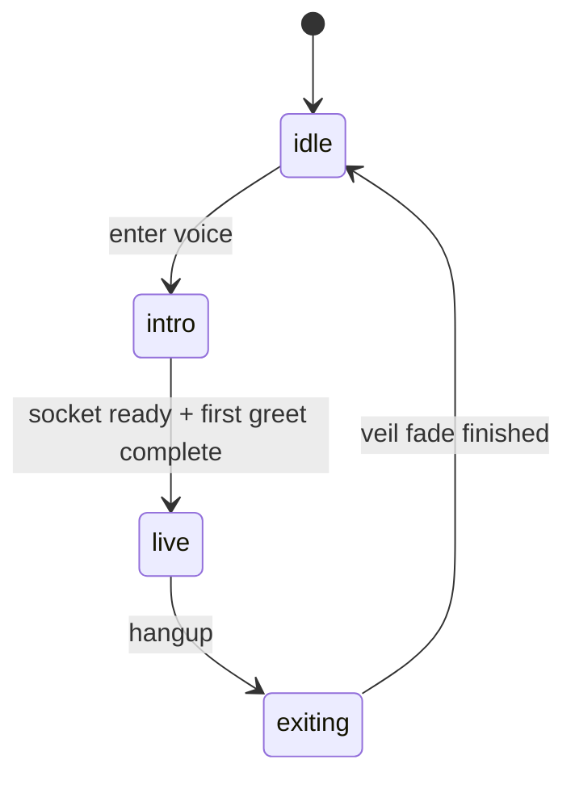
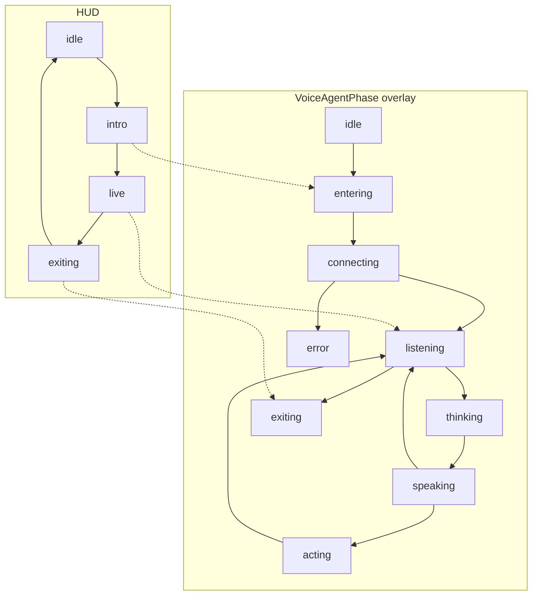
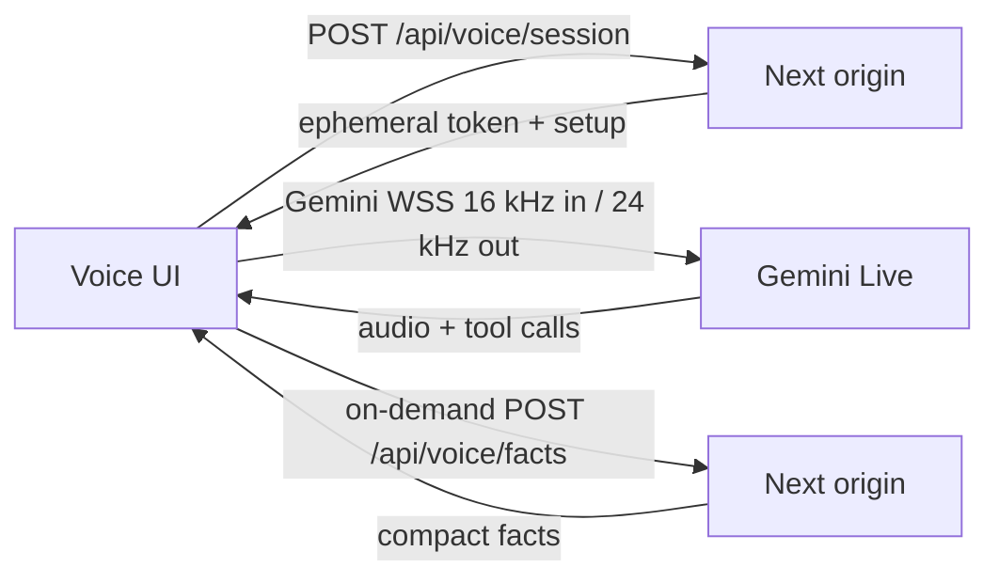
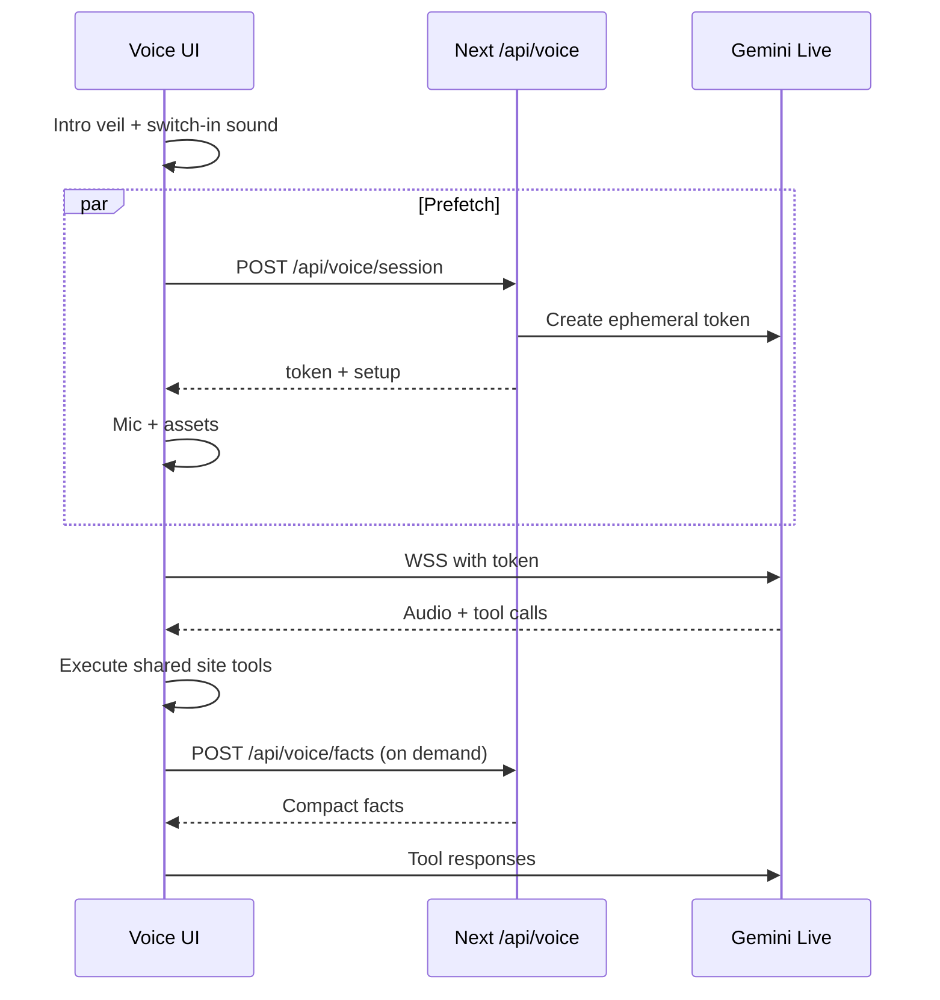

# Native Voice Agent

Production voice mode for the sketchbook. The browser talks to a native
audio model. Site tools stay model-agnostic. Switching providers should
only require changing the voice-caller adapter.

The HUD, welcome, audio timing, and barge-in polish shipped in `v0.24.0`.
The app is `0.30.0` and later.

## Decisions

| Topic | Decision |
|---|---|
| Entry | Homepage folded-note CTA `Talk to me`, plus settings `Enter voice mode`, command palette `action-enter-voice-mode`, chat-page corner control, and the chat-only `start_voice_session` tool. Starting voice does not navigate to `/chat`. |
| Persistence | Module singleton `voiceSessionRuntime` owns the live socket, playback, capture, and action queue. React only subscribes. Same call across routes = same socket. The socket stays open only while the call is live; after a spoken idle check-in and hangup the host closes it. New call after hangup remints and greets once. |
| HUD | Intro is a blocking black veil until socket ready + first greet `turnComplete` + playback idle. Then the veil fades via a CSS opacity transition and one persistent GIF orb FLIPs into a non-modal dock. FLIP ignores agent phase (`listening`/`speaking`) and only restarts when the hero/dock slot, reduced motion, or mobile layout changes. The landscape GIF is left-cropped into a hard circle. The speaking attribute is gated on `phase === 'speaking'`; playback level scales ripple only. Acting uses a distinct amber/violet halo. Live hangup is a red phone to the right of the orb. Toggle plays on enter/exit, ambient unlocks silently on that gesture then fades in at ~0.12 (duck 0.04; quieter on coarse pointers), and one action cue fires per committed visual tool. Sound URLs are version-query cache-busted. Dock captions fade after ~700ms. Assets prefetch on enter, not on idle page load. Exiting holds a ~2.2s black veil with a picked “taking you back” line; the fade must finish before unmount. |
| Queue | Send tool replies immediately. Commit visuals later: `navigate_to`, `open_*`, and `end_voice_session` wait for playback idle. Hangup twice forces. Client `planVoiceUtterance` backfills explicit chains (max 3) into the same FIFO queue and keeps successful prefixes when a later clause is unknown. Unknown `type <token>` fills `terminal-input` without submit; unsafe tokens are skipped. Dependent hosts (`project-video`, `terminal`, `chat`) must be ready before those commits. |
| Transport | Client-to-model WebSocket with ephemeral tokens minted by `POST /api/voice/session`. PCM does not transit the origin. There is no Cloudflare Worker in the request path. |
| Default voice | Male `Charon`. |
| Context | Tiny system prompt plus on-demand `lookup_site_facts`. No full fact bank in the live session. |
| Tools | Shared `siteTools` registry. Chat and voice use the same names. `hint` is the one puzzle-safe voice terminal command; do not add a second tool-calling model. |
| Compression | Gemini Live is PCM only (16 kHz in, 24 kHz out). The settings toggle is **low-network mode**: smaller frames, no live transcripts, no ambient music. |
| Context window | Live `contextWindowCompression` is always enabled. |
| Pipeline | Staging/production inject `VOICE_AGENT_API_KEY` from `STAGING_VOICE_AGENT_API_KEY` / `PRODUCTION_VOICE_AGENT_API_KEY`. |

## HUD and agent state

HUD phases are `idle`, `intro`, `live`, and `exiting`. `VoiceAgentPhase`
overlays that HUD while the call is active.

`VoiceAgentPhase` values are `idle`, `entering`, `connecting`, `listening`,
`thinking`, `speaking`, `acting`, `exiting`, and `error`. The overlay diagram
is a catalog of those labels, not a claim that every transition is used.

## Live audio pipeline

The browser mints a session on the origin, then opens Gemini Live directly.
PCM does not transit the origin.

Ambient HTMLAudio fades in at about 0.12 and ducks to 0.04 under speech
(about 0.084 / 0.028 on coarse pointers). Mic PCM is withheld while playback is
busy, including a 320ms hangover after the last scheduled PCM and after an
interrupt, so inter-chunk gaps do not ungate the mic. If Gemini reports an
interruption, playback hard-stops and that hangover still mutes capture; that
is not a full local barge-in / echo-cancellation redesign. If the browser
denies the microphone, the session still connects, speaks a permission
prompt, waits 10s, then speaks a timeout line and hangs up after that audio.
A late grant starts capture and sends the withheld welcome without reminting.

## Flow

## Model-agnostic boundary

- UI, settings, and tools import `@/lib/voiceAgentProtocol` and `@/lib/siteTools`.
- Only `@/lib/geminiLiveAdapter.ts` and server token minting know Gemini.
- A future OpenAI Realtime / other adapter implements `VoiceCaller`.

## Tools

Shared names:

- `navigate_to`
- `set_theme`
- `open_project`
- `close_project`
- `control_project_video`
- `open_link`
- `open_feedback`
- `open_command_palette`
- `open_shortcuts`
- `open_chat`
- `browse_history`
- `scroll_page`
- `send_chat_message`
- `run_terminal_command`
- `fill_field`
- `set_preference`
- `set_voice_output`
- `set_voice_backend`
- `set_motion_preference`
- `submit_guestbook`
- `submit_feedback`
- `lookup_site_facts`
- `start_voice_session`
- `end_voice_session`

Live voice tools omit `start_voice_session`. Chat/text can still offer it.

## Welcome

On connect, the host picks one greeting and one invitation from hardcoded
catalogs in `voiceAgentProtocol`. Greetings open warmly, then briefly
introduce Dhruv Mishra's portfolio. Invitations may use natural
“try saying” phrasing. The spoken cue concatenates greeting + invitation
as one exact line and has no `Hint:` label. After a quiet live stretch the
host sends a picked check-in, then a hangup line, then closes the socket.
Hangup first shows a picked exit-veil line on the black screen for ~2.2s;
the fade must finish before unmount. Random selection stays out of the
model prompt. After the first spoken turn finishes, the veil settles into
a floating dock and the rest of the site stays interactive. Dock captions
fade after ~700ms; orb ripples stay up while PCM is still playing. Gemini
VAD uses LOW start/end sensitivity with padding. Ambient unlocks on the
enter gesture and becomes audible after the toggle. Off-topic asks get a
short in-character redirect back to the site.
